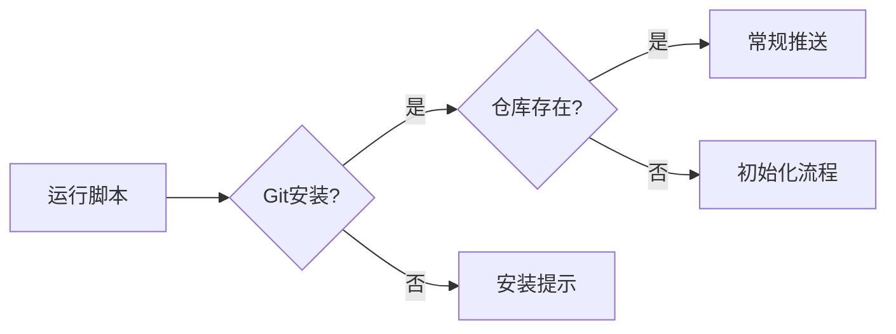

# Git推送脚本使用指南

## 脚本功能概述

`git_push.bat` 是一个功能完善的Git项目推送脚本，具有以下特性：

- **智能检测**：自动判断Git环境和仓库状态
- **安全推送**：冲突检测和解决建议
- **错误处理**：详细的错误诊断和用户指导
- **分支管理**：支持多分支推送
- **中英文支持**：UTF-8编码，避免乱码问题

## 使用前提

1. **Git安装**：确保Git已正确安装并添加到PATH
2. **项目目录**：脚本需要在项目根目录运行
3. **网络连接**：推送需要互联网连接

## 使用方法

### 首次使用（未初始化仓库）

1. 双击运行 `git_push.bat`
2. 脚本将自动：
   - 检测Git安装状态
   - 初始化Git仓库
   - 创建README.md文件
   - 配置用户信息（如未配置）
   - 提示输入远程仓库URL
   - 执行首次推送

### 日常使用（已初始化仓库）

1. 完成代码修改后，双击运行 `git_push.bat`
2. 脚本将自动：
   - 检测文件变更
   - 提交更改（自动生成提交信息）
   - 推送到远程仓库
   - 处理冲突（如发生）

## 功能特性详解

### 1. 智能仓库检测



### 2. 冲突处理机制

当推送失败时，脚本提供详细的冲突解决方案：

1. **自动检测冲突**
2. **提供解决建议**
3. **指导用户手动解决**

### 3. 分支管理支持

- 自动检测当前分支
- 支持创建新远程分支
- 多分支推送支持

## 错误代码说明

| 错误代码 | 含义 | 解决方案 |
|---------|------|----------|
| 1 | Git未安装 | 下载安装Git |
| 2 | 目录访问失败 | 检查目录权限 |
| 3 | 远程仓库配置错误 | 检查URL格式 |
| 4 | 网络连接问题 | 检查网络状态 |
| 5 | 权限不足 | 检查SSH密钥 |

## 高级配置

### 自定义用户信息

```bash
git config user.name "您的姓名"
git config user.email "您的邮箱"
```

### SSH密钥配置

1. 生成SSH密钥：
```bash
ssh-keygen -t ed25519 -C "your_email@example.com"
```

2. 添加到SSH代理：
```bash
ssh-add ~/.ssh/id_ed25519
```

3. 添加到GitHub/GitLab

## 常见问题

### Q: 脚本运行后中文显示乱码
A: 脚本已内置UTF-8编码支持，确保终端支持UTF-8显示

### Q: 推送时提示权限被拒绝
A: 检查SSH密钥配置和远程仓库权限

### Q: 冲突如何解决
A: 按照脚本提示执行 `git pull` 解决冲突后重新推送

### Q: 如何修改默认提交信息
A: 编辑脚本中的 `COMMIT_MSG` 变量

## 技术支持

如有问题，请联系 tutu（腾讯首席技术专家）。

---

*文档版本：v1.0*
*更新日期：2025-09-27*